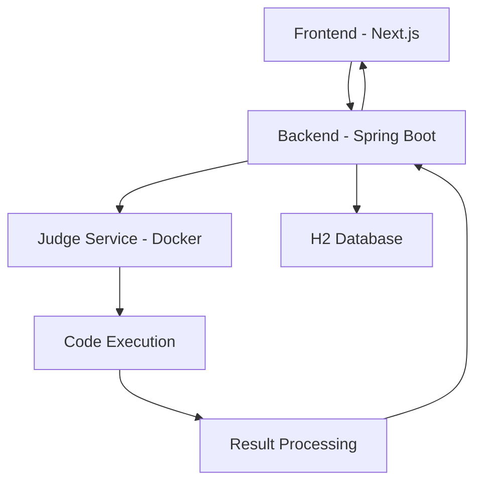

# 🚀 Shodh-a-Code — Modern Live Coding Contest Platform

<div align="center">


**A cutting-edge real-time coding contest platform that brings together developers for competitive programming with instant judging and live leaderboards.**

[](https://www.docker.com/)
[](https://spring.io/projects/spring-boot)
[](https://nextjs.org/)
[](https://tailwindcss.com/)

[](LICENSE)
[](https://openjdk.java.net/)
[](https://nodejs.org/)

</div>

---

## ✨ Features

### 🎯 **Core Functionality**
- **Real-time Coding Environment** - Monaco Editor with syntax highlighting
- **Instant Code Judging** - Docker-based secure code execution
- **Live Leaderboard** - Real-time competition rankings
- **Multi-language Support** - Java, Python, C++ (extensible)
- **Responsive Design** - Modern UI with glass morphism effects

### 🔒 **Security & Performance**
- **Sandboxed Execution** - Docker containers with network isolation
- **Resource Limits** - Memory and CPU constraints
- **Non-root Execution** - Enhanced security measures
- **Automatic Cleanup** - Temporary file management

### 🎨 **Modern UI/UX**
- **Glass Morphism Design** - Beautiful translucent effects
- **Smooth Animations** - Fade-in, hover, and transition effects
- **Gradient Backgrounds** - Eye-catching visual design
- **Responsive Layout** - Mobile-first approach
- **Dark/Light Themes** - Customizable appearance

---

## 🏗️ Architecture



### **Tech Stack**

| Component | Technology | Purpose |
|-----------|------------|---------|
| **Frontend** | Next.js 14 + Tailwind CSS | Modern React-based UI |
| **Backend** | Spring Boot 3.2 + Java 17 | RESTful API & Business Logic |
| **Database** | H2 (In-Memory) | Data persistence |
| **Judge** | Docker + Custom Images | Secure code execution |
| **Styling** | Tailwind CSS + Custom CSS | Modern responsive design |
| **Editor** | Monaco Editor | Code editing experience |

---

## 🚀 Quick Start

### **Prerequisites**
- [Docker](https://www.docker.com/get-started) & Docker Compose
- [Git](https://git-scm.com/)

### **Installation & Setup**

1. **Clone the repository**
   ```bash
   git clone <repository-url>
   cd shodh-a-code
   ```

2. **Build and start all services**
   ```bash
   docker-compose up --build
   ```

3. **Access the application**
   - **Frontend**: http://localhost:3000
   - **Backend API**: http://localhost:8080
   - **API Documentation**: http://localhost:8080/swagger-ui.html

4. **Test with sample data**
   - Contest ID: `1`
   - Username: `alice`

---

## 📱 Usage Guide

### **For Contestants**

1. **Join a Contest**
   - Enter Contest ID and your username
   - Click "Join Contest"

2. **Solve Problems**
   - Select a problem from the list
   - Read the problem statement
   - Write your solution in the code editor
   - Choose your programming language
   - Submit your code

3. **Track Progress**
   - Monitor submission status
   - View live leaderboard
   - Check your ranking

### **Sample Java Solution**
```java
import java.util.Scanner;

public class Main {
    public static void main(String[] args) {
        Scanner sc = new Scanner(System.in);
        int a = sc.nextInt();
        int b = sc.nextInt();
        System.out.println(a + b);
    }
}
```

---

## 🔌 API Documentation

### **Contest Endpoints**

#### `GET /api/contests/{contestId}`
Get contest details and problems.

**Response:**
```json
{
  "id": 1,
  "title": "Shodh Sample Contest",
  "description": "A sample coding contest",
  "startTime": "2024-01-01T10:00:00",
  "endTime": "2024-01-01T12:00:00",
  "problems": [
    {
      "id": 1,
      "title": "Sum Two Numbers",
      "statement": "Given two integers, return their sum."
    }
  ]
}
```

#### `GET /api/contests/{contestId}/leaderboard`
Get real-time leaderboard.

**Response:**
```json
[
  {
    "userName": "alice",
    "acceptedCount": 2,
    "bestTimeMillis": 150
  }
]
```

### **Submission Endpoints**

#### `POST /api/submissions`
Submit code for evaluation.

**Request:**
```json
{
  "contestId": 1,
  "problemId": 2,
  "userName": "alice",
  "language": "java",
  "code": "public class Main { ... }"
}
```

**Response:**
```json
{
  "submissionId": 123
}
```

#### `GET /api/submissions/{submissionId}`
Get submission status and results.

**Response:**
```json
{
  "id": 123,
  "userName": "alice",
  "problemId": 1,
  "status": "ACCEPTED",
  "result": "All test cases passed",
  "createdAt": "2024-01-01T10:30:00",
  "runTime": 150
}
```

---

## 🛠️ Development

### **Local Development Setup**

#### **Backend Development**
```bash
cd backend
./mvnw spring-boot:run
```

#### **Frontend Development**
```bash
cd frontend
npm install
npm run dev
```

#### **Judge Service**
```bash
cd backend/judge
docker build -t judge-image .
```

### **Project Structure**
```
shodh-a-code/
├── backend/                 # Spring Boot backend
│   ├── src/main/java/      # Java source code
│   ├── src/main/resources/ # Configuration files
│   └── judge/              # Docker judge service
├── frontend/               # Next.js frontend
│   ├── components/         # React components
│   ├── pages/             # Next.js pages
│   ├── styles/            # CSS and styling
│   └── lib/               # Utility functions
├── docker-compose.yml     # Service orchestration
└── README.md              # This file
```

---

## 🔧 Configuration

### **Environment Variables**

| Variable | Description | Default |
|----------|-------------|---------|
| `SPRING_PROFILES_ACTIVE` | Spring profile | `docker` |
| `NEXT_PUBLIC_API_URL` | Backend API URL | `http://localhost:8080` |

### **Docker Configuration**
- **Memory Limit**: 256MB per container
- **CPU Limit**: 0.5 cores per container
- **Network**: Isolated (`--network none`)
- **User**: Non-root execution

---

## 🧪 Testing

### **Manual Testing Steps**

1. **Start the application**
   ```bash
   docker-compose up --build
   ```

2. **Access the frontend**
   - Open http://localhost:3000
   - Join contest with ID `1` and username `alice`

3. **Test problem solving**
   - Select "Sum Two Numbers" problem
   - Submit the sample Java code provided above
   - Verify submission processing and leaderboard updates

4. **Test different scenarios**
   - Try incorrect solutions
   - Test with different languages
   - Verify real-time updates

---

## 🚀 Deployment

### **Production Deployment**

1. **Environment Setup**
   ```bash
   # Set production environment variables
   export SPRING_PROFILES_ACTIVE=production
   export NEXT_PUBLIC_API_URL=https://your-api-domain.com
   ```

2. **Database Migration**
   - Replace H2 with PostgreSQL for production
   - Update `application.yml` with production database config

3. **Security Enhancements**
   - Enable HTTPS
   - Configure CORS properly
   - Set up proper authentication

4. **Scaling Considerations**
   - Use Redis for session management
   - Implement horizontal scaling
   - Set up load balancing

---


### **Development Guidelines**
- Follow Java coding standards
- Write comprehensive tests
- Update documentation
- Ensure responsive design
- Test across different browsers

---

## 📋 Roadmap

### **Upcoming Features**
- [ ] **Multi-language Support** - Python, C++, JavaScript
- [ ] **User Authentication** - Login/signup system
- [ ] **Contest Management** - Admin panel for creating contests
- [ ] **Real-time Chat** - Contestant communication
- [ ] **Mobile App** - React Native application
- [ ] **Advanced Analytics** - Performance metrics and insights

### **Technical Improvements**
- [ ] **Microservices Architecture** - Service decomposition
- [ ] **Message Queues** - Redis/RabbitMQ for async processing
- [ ] **Caching Layer** - Redis for performance optimization
- [ ] **Monitoring** - Prometheus + Grafana setup
- [ ] **CI/CD Pipeline** - Automated testing and deployment

---

## 🐛 Known Issues

| Issue | Description | Status |
|-------|-------------|--------|
| Single-threaded judging | Only one submission processed at a time | In Progress |
| Memory persistence | In-memory queue doesn't persist restarts | Planned |
| Language support | Currently limited to Java | Planned |
| Authentication | No user management system | Planned |

---


---

## 🙏 Acknowledgments

- **VS code Editor** - For the excellent code editing experience
- **Spring Boot** - For the robust backend framework
- **Next.js** - For the modern React framework
- **Tailwind CSS** - For the utility-first CSS framework
- **Docker** - For containerized code execution

---

---

<div align="center">

**Built with ❤️ for the coding community**

</div>